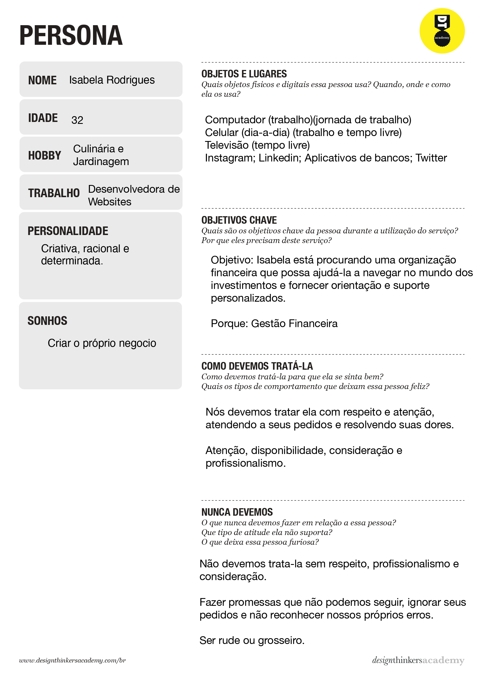
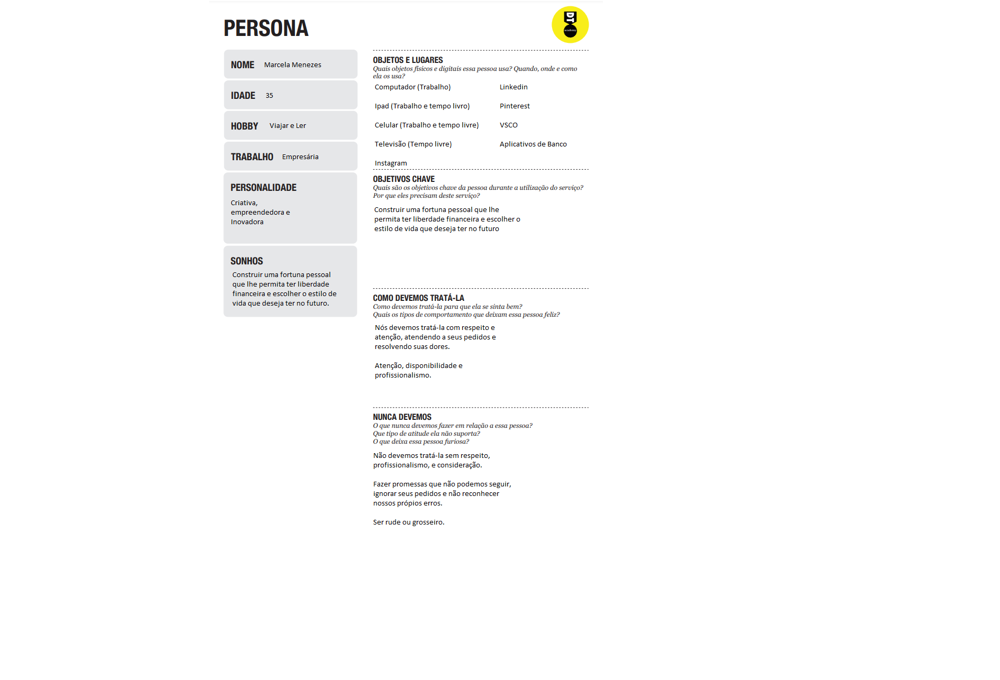
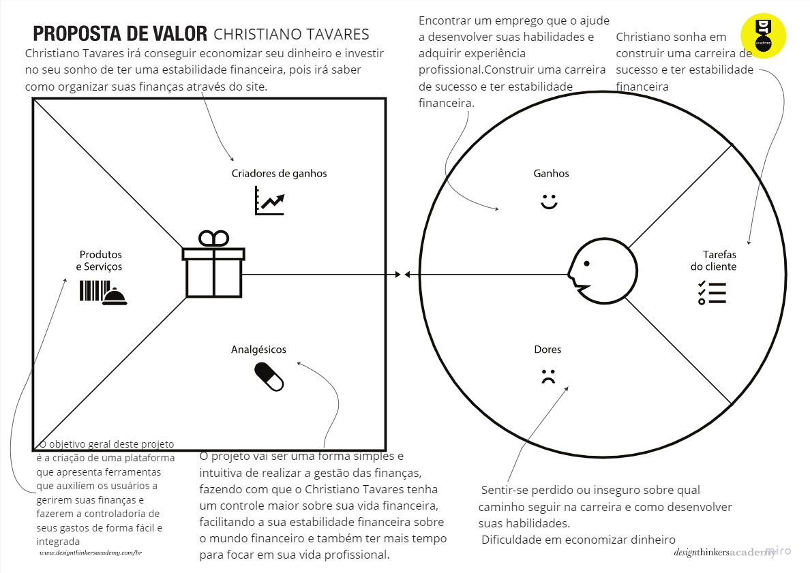
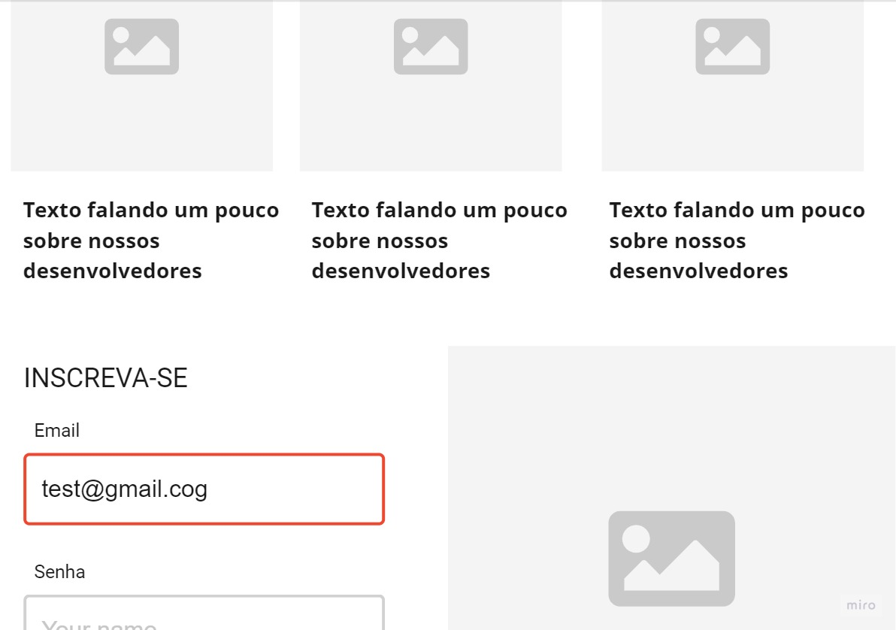
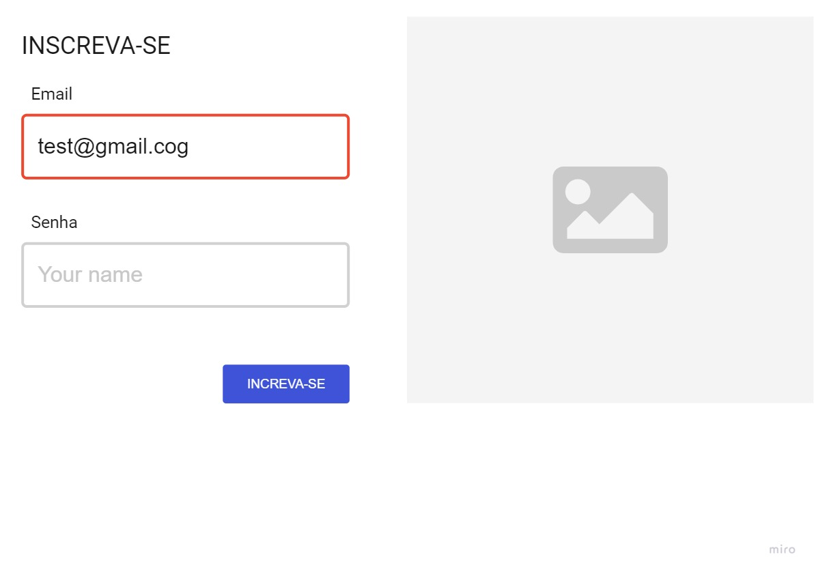
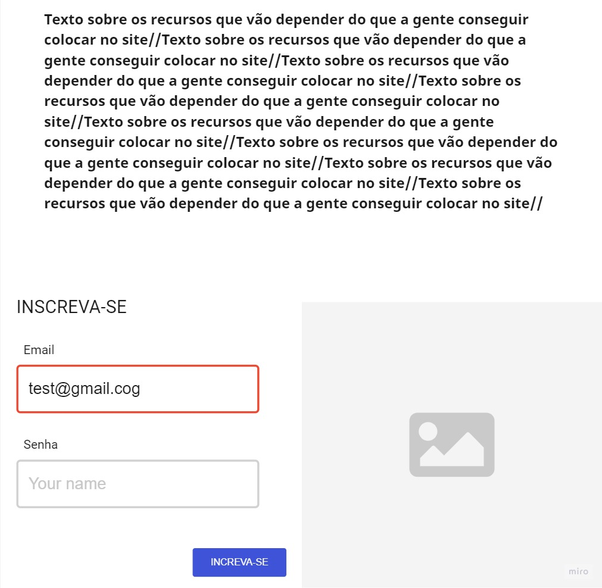

# Informações do Projeto
`TÍTULO DO PROJETO`  

......  COLOQUE AQUI O SEU TEXTO ......

`CURSO` 

......  COLOQUE AQUI O SEU TEXTO ......

## Participantes

......  COLOQUE AQUI O SEU TEXTO ......

> Inclua a lista dos membros da equipe com seus nomes completos.
>
> Os membros do grupo são: 
> - João Madeira Carneiro Braga de Freitas
> - João Lucas Azeredo Coutinho Curi
> - Emanuel Gandra Almeida Duque Cabral

# Estrutura do Documento

- [Informações do Projeto](#informações-do-projeto)
  - [Participantes](#participantes)
- [Estrutura do Documento](#estrutura-do-documento)
- [Introdução](#introdução)
  - [Problema](#problema)
  - [Objetivos](#objetivos)
  - [Justificativa](#justificativa)
  - [Público-Alvo](#público-alvo)
- [Especificações do Projeto](#especificações-do-projeto)
  - [Personas, Empatia e Proposta de Valor](#personas-empatia-e-proposta-de-valor)
  - [Histórias de Usuários](#histórias-de-usuários)
  - [Requisitos](#requisitos)
    - [Requisitos Funcionais](#requisitos-funcionais)
    - [Requisitos não Funcionais](#requisitos-não-funcionais)
  - [Restrições](#restrições)
- [Projeto de Interface](#projeto-de-interface)
  - [User Flow](#user-flow)
  - [Wireframes](#wireframes)
- [Metodologia](#metodologia)
  - [Divisão de Papéis](#divisão-de-papéis)
  - [Ferramentas](#ferramentas)
  - [Controle de Versão](#controle-de-versão)
- [**############## SPRINT 1 ACABA AQUI #############**](#-sprint-1-acaba-aqui-)
- [Projeto da Solução](#projeto-da-solução)
  - [Tecnologias Utilizadas](#tecnologias-utilizadas)
  - [Arquitetura da solução](#arquitetura-da-solução)
- [Avaliação da Aplicação](#avaliação-da-aplicação)
  - [Plano de Testes](#plano-de-testes)
  - [Ferramentas de Testes (Opcional)](#ferramentas-de-testes-opcional)
  - [Registros de Testes](#registros-de-testes)
- [Referências](#referências)

# 1 Introdução:

A organização financeira é um objetivo de muitos indivíduos na sociedade brasileira, entretanto tal organização, muitas vezes, não é alcançada por conta da falta de meios e de conhecimentos em educação financeira. Nesse sentido, a proposta deste trabalho é apresentar um projeto de desenvolvimento de um aplicativo de controladoria e organização financeira, que tem como objetivo auxiliar os brasileiros na gestão de suas finanças pessoais.

O projeto, que será desenvolvido pelos integrantes do grupo, terá diversas funcionalidades que permitirão aos usuários registrar suas receitas e despesas, fazer o acompanhamento do orçamento, estabelecer metas financeiras e integrar os orçamentos de diferentes usuários, para casos de família ou de amigos.

Ao longo deste relatório, serão apresentados os pontos principais pelos quais ocorreram o processo de especificação e de criatividade do projeto e os planejamentos em relação a metodologia e a interface do site. 

## 1.1 Problema:
Conforme exposto, o problema que se busca resolver com este projeto é a dificuldade para a organização financeira individual ou conjunta de um grupo de indivíduos, devida a falta de ferramentas simplificadas e acessíveis.  

Possibilitar aos indivíduos uma ferramenta auxiliar para gerirem as suas finanças e fazer a controladoria de seus gastos de forma fácil e integrada.

## 1.2 Objetivos
O objetivo geral deste trabalho é a criação de uma plataforma que apresenta ferramentas que auxiliem os usuários a gerirem suas finanças e fazerem a controladoria de seus gastos de forma fácil e integrada.
Como objetivos específicos, podemos ressaltar:
    
    -Rastreamento de despesas para permitir que os usuários acompanhem suas despesas diárias e as categorizem por tipo, como alimentação, transporte, lazer, entre outros.
    
    -Organização Financeira.
    
    -Alertas de gastos, enviar notificações para usuários quando eles estiverem se aproximando ou ultrapassando seus limites de gastos, ou quando uma conta estiver prestes a vencer.
    
    -Segurança e privacidade, garantir que o aplicativo seja seguro e proteja a privacidade dos usuários, usando criptografia para proteger dados pessoais e financeiros.

## 1.3 Justificativa
A organização financeira é imprescindível para os indivíduos que desejam ter qualidade de vida e/ou sucesso financeiro. De acordo com o  "The Benefits of Creating a Budget", artigo do site Forbes, a organização financeira fazendo o uso de um orçamento é necessária para alcançar e traçar as suas metas financeiras	
Paralelamente, há uma carência de plataformas simplificadas e acessíveis de registro integrado de contas e gastos, e que permitam aos usuários gerenciar e estabelecer limites de gastos para diferentes categorias, como transporte, saúde e alimentação. 

## 1.4 Público-Alvo
Nossa plataforma visa atender toda e qualquer pessoa com interesse em obter uma organização financeira, sejam indivíduos recém inseridos no mercado, ou qualquer outra pessoa que queira gerir suas finanças.

Contudo, estabeleceu-se como público-alvo os homens e as mulheres entre 25 e 48 anos que, em geral, são indivíduos que trabalham de forma remunerada e buscam obter uma maior estabilidade financeira e por muitas vezes buscam fazer uma gestão de gastos e controle de suas finanças, procurando economizar e/ou fazer controladoria de gastos.

 
# 2 Especificações do Projeto
A definição exata do problema e os pontos mais relevantes a serem tratados neste projeto foi consolidada com a participação dos usuários em um trabalho de imersão feito pelos membros da equipe a partir da observação dos usuários em seu local natural e por meio de entrevistas. Os detalhes levantados nesse processo foram consolidados na forma de personas e histórias de usuários.

## 2.1 Personas, Empatia e Proposta de Valor

As personas levantadas durante o processo de entendimento do problema são apresentadas na Figuras que se seguem.

> 
> 
> 
> 

> **Proposta de Valor**
> 
> 
> 
> 

## 2.2 Histórias de Usuários

Com base na análise das personas forma identificadas as seguintes histórias de usuários:

|EU COMO... `PERSONA`| QUERO/PRECISO ... `FUNCIONALIDADE` |PARA ... `MOTIVO/VALOR`                 |
|--------------------|------------------------------------|----------------------------------------|
|Isabela Rodrigues   |uma organização financeira que possa|       abrir seu próprio negócio        |
|                    |ajudá-la a navegar no mundo dos     |                                        |
|                    |investimentos e fornecer orientação |                                        |
|                    |e suporte personalizados            |                                        |
|--------------------|------------------------------------|----------------------------------------|
|Luiz Gustavo        |uma forma mais eficiente de gerir   |  Comprar uma casa e viajar pelo mundo  |
|                    |suas finanças conjuntas com sua     |                                        |
|                    |esposa, com o objetivo de economizar|                                        |
|                    |dinheiro                            |                                        |
|--------------------|------------------------------------|----------------------------------------|
|Christiano Tavares  |uma forma simples de organizar minha|    Economizar dinheiro e alcançar a    |
|                    |vida financeira, em que eu posso ter|   estabilidade financeira              |
|                    |controle dos meus gastos de forma   |                                        |
|                    |clara                               |                                        |
|--------------------|------------------------------------|----------------------------------------|
|Marcela Menezes     |uma forma de ter um melhor controle |    Diminuir os gastos excessivos,      |
|                    |sobre seus gastos                   |alcançando uma vida financeira sem      |
|                    |                                    |preocupações                            |
|                    |                                    |                                        |
|--------------------|------------------------------------|----------------------------------------|

> projeto de sua solução. As Histórias de Usuário consistem em uma
> ferramenta poderosa para a compreensão e elicitação dos requisitos
> funcionais e não funcionais da sua aplicação. Se possível, agrupe as
> histórias de usuário por contexto, para facilitar consultas
> recorrentes à essa parte do documento.
>
> **Links Úteis**:
> - [Histórias de usuários com exemplos e template](https://www.atlassian.com/br/agile/project-management/user-stories)
> - [Como escrever boas histórias de usuário (User Stories)](https://medium.com/vertice/como-escrever-boas-users-stories-hist%C3%B3rias-de-usu%C3%A1rios-b29c75043fac)

## 2.3 Requisitos
O escopo funcional do projeto é definido por meio dos requisitos funcionais que descrevem as possibilidades interação dos usuários, bem como os requisitos não funcionais que descrevem os aspectos que o sistema deverá apresentar de maneira geral. Estes requisitos são apresentados a seguir.

### 2.3.1 Requisitos Funcionais
A tabela a seguir apresenta os requisitos do projeto, identificando a prioridade em que os mesmos devem ser entregues.

|ID    | Descrição do Requisito  | Prioridade    |      |
|------|-----------------------------------------|------|
|RF-001|O site deve permitir que os usuários     |      |
|      |registrem todas as suas receitas e       |ALTA  |
|      |despesas de forma fácil e organizada.    |      |
|      |                                         |      |
|------|-----------------------------------------|------| 
|RF-002|O site deve permitir que os usuários.    |      |
|      |criem e gerenciem seus orçamentos mensais|ALTA  |
|      |e anuais.                                |      |
|      |                                         |      |
|------|-----------------------------------------|------|
|RF-003|O site deve enviar alertas aos usuários  |      |
|      |quando estiverem próximos de atingir seus|ALTA  |
|      |limites de gastos.                       |      |
|      |                                         |      |
|------|-----------------------------------------|------|
|RF-004|O site deve permitir que os usuários     |      |
|      |classifiquem suas transações em          |ALTA  |
|      |categorias, como alimentação, transporte,|      |
|      | moradia, entre outras.                  |      |
|------|-----------------------------------------|------|
|RF-005|O site deve apresentar uma previsão do   |      |
|      |fluxo de caixa futuro, com base nas      |MEDIA |
|      |informações inseridas pelo usuário.      |      |
|      |                                         |      |
|------|-----------------------------------------|------|
|RF-006|O site deve permitir que os usuários     |      |
|      |gerem relatórios financeiros, como       |BAIXA |
|      |balanços e demonstrações de resultados.  |      |
|      |                                         |      |
|------|-----------------------------------------|------|
|RF-007|Permitir a integração da portabilidade de|      |
|      |dois ou mais usuários na plataforma,     |MEDIA |
|      |permitindo a organização financeira      |      |
|      |conjunta de casais e/ou famílias.        |      |
|------|-----------------------------------------|------|
|RF-008|O site deve enviar notificações aos      |      |
|      |usuários quando suas contas estiverem    |MEDIA |
|      |próximas do vencimento, para que não     |      |
|      |sejam esquecidas ou pagas com atraso.    |      |
|------|-----------------------------------------|------|
|RF-009|O site deve permitir a integração com    |      |
|      |ferramentas como  calendários e listas de|BAIXA |
|      |tarefas, para que os usuários possam     |      |
|      |gerenciar suas finanças de forma mais    |      |
|------|-----------------------------------------|------|

### 2.3.2 Requisitos não Funcionais
A tabela a seguir apresenta os requisitos não funcionais que o projeto deverá atender.
|ID    | Descrição do Requisito                                                 | Prioridade |
|------|------------------------------------------------------------------------|------------|
|------|------------------------------------------------------------------------|------------|
|RF-001| O site deve ser publicado em um ambiente acessível                     |            |
|      |publicamente na Internet (Repl.it, GitHub Pages, Heroku);               |    ALTA    |
|------|------------------------------------------------------------------------|            |
|RF-002| O site deverá ser responsivo permitindo                                |            |
|      | a visualização em um celular de forma adequada                         |    ALTA    |
|------|------------------------------------------------------------------------|------------|
|RF-003| O site deve ter bom nível de contraste                                 |            |
|      | entre os elementos da tela em conformidade                             |    MÉDIA   |
|------|------------------------------------------------------------------------|------------|
|RF-004| O site deve ser compatível com os principais                           |            |
|      | navegadores do mercado (Google Chrome, Firefox, Microsoft Edge)        |    ALTA    |
|------|------------------------------------------------------------------------|------------|
|RF-005| O site deve ser seguro e garantir a privacidade dos dados dos usuários |            | 
|      | por meio de criptografia, autenticação de usuários, backup de dados e  |            |
|      | outras medidas de segurança.                                           |    ALTA    |
|------|------------------------------------------------------------------------|------------|
|RF-006| O site deve estar disponível 24 horas por dia, 7 dias por semana,      |            |
|      | com tempo de inatividade mínimo ou nulo                                |    ALTA    |
|------|------------------------------------------------------------------------|------------|
|RF-007| O site deve ser fácil de usar e navegar, com uma interface intuitiva e |            |
|      | bem projetada, e com suporte para vários dispositivos,                 |            |
|      | como computadores e dispositivos móveis.                               |    ALTA    |
|------|------------------------------------------------------------------------|------------|

## 2.4 Restrições

As questões que limitam a execução desse projeto e que se configuram como obrigações claras para o desenvolvimento do projeto em questão são apresentadas na tabela a seguir.

|ID| Restrição                                                                |
|--|--------------------------------------------------------------------------|
|01| O projeto deverá ser entregue até o final do semestre                    |
|02| O aplicativo deve se restringir às tecnologias básicas da Web no Frontend|
|03| A equipe não pode subcontratar o desenvolvimento do trabalho             |
|--|--------------------------------------------------------------------------|

# 3 Projeto de Interface

De acordo com os objetivos traçados nas etapas anteriores, a preocupação em torno da montagem da interface do sistema é fazer uma plataforma que tenha uma interface simples e de fácil utilização.

## 3.1 User Flow
O diagrama apresentado na Figura “Fluxo de telas do usuário” mostra o fluxo de interação do usuário pelas telas do sistema. Cada uma das telas deste fluxo é detalhada na seção de Wireframes que se segue. Para visualizar o wireframe interativo, acesse o ambiente MarvelApp do projeto.
> 

## 3.2 Wireframes
Conforme fluxo de telas do projeto, apresentado no item anterior, as telas do sistema são apresentadas em detalhes nos itens que se seguem. As telas do sistema apresentam uma estrutura que é apresentada na Figura “Fluxo de telas do usuário” . Nesta estrutura, existem 3 grandes interfaces, descritos a seguir. São eles:
  -Home Page - Página na qual é a inicial do site, contendo diversas imagens chamativas e informações do produto para conquistar o cliente ;
  -Quem Somos - apresenta a história criativa e de desenvolvimento da nossa plataforma e fala sobre os integrantes do projeto;
  -Planos e Recursos - apresenta os planos da nossa plataforma para o usuário e detalha sobre os recursos do nosso projeto.

## 3.3 Tela - Home-Page
A tela de home-page é a página inicial do site, contendo diversas imagens chamativas e informações do produto para conquistar o cliente. O bloco superior da tela tem os principais acessos às outras telas do site:
  -Componente de CADASTRE-SE leva o usuário ao campo de increva-se;
  -Componente de LOGIN abre a caixa para login ;
  -Componente de PERGUNTAS FREQUENTES mostra ao usuário perguntas recorrentes dos internautas;
  -Componente de ENVIAR SUA PERGUNTA permite ao usuário enviar perguntas para os desenvolvedores;
  -Componente de INSCREVA-SE permite ao usuário realizar seu cadastro no site;
  -Componentes de QUEM SOMOS e PLANOS E RECURSOS dão acesso às páginas de cada uma das seções disponibilizadas abaixo, respectivamente;

> 
> 
> 
> 
> 

## 3.4 Tela - Quem Somos
A tela de categoria Quem Somos apresenta os:
 
  -Informações sobre a história criativa e de desenvolvimento da nossa plataforma e fala sobre os integrantes do projeto;
  -Componente de INSCREVA-SE permite ao usuário realizar seu cadastro no site;
  -Componentes de HOME e PLANOS E RECURSOS dão acesso às páginas de cada uma das seções disponibilizadas;

> 
> 
> 
> 

## 3.5 Tela - Planos e Recursos
A tela de categoria Planos e Recursos apresenta os:
  -Planos da nossa plataforma para o usuário e detalha sobre os recursos do nosso projeto;
  -Componente de INSCREVA-SE permite ao usuário realizar seu cadastro no site;
  -Componentes de HOME e PLANOS E RECURSOS dão acesso às páginas de cada uma das seções disponibilizadas;

> 
> 
> 

#  4 Metodologia

A metodologia contempla as definições de ferramental utilizado pela equipe tanto para a manutenção dos códigos e demais artefatos quanto para a organização do time na execução das tarefas do projeto.

## 4.1 Divisão de Papéis
A equipe utiliza metodologias ágeis, tendo escolhido o Scrum como base para definição do processo de desenvolvimento.

A equipe está organizada da seguinte maneira:
  -Scrum Master: Emanuel Gandra
  -Product Owner: João Madeira
  -Equipe de Desenvolvimento
    -João Lucas Curi
    -Emanuel Gandra
    -João Madeira

Para organização e distribuição das tarefas do projeto, a equipe está utilizando o Trello estruturado com as seguintes listas: 

  Backlog: recebe as tarefas a serem trabalhadas e representa o Product Backlog. Todas as atividades identificadas no decorrer do projeto também devem ser incorporadas a esta lista.
  To Do: Esta lista representa o Sprint Backlog. Este é o Sprint atual que estamos trabalhando.
  Doing: Quando uma tarefa tiver sido iniciada, ela é movida para cá.
  Test: Checagem de Qualidade. Quando as tarefas são concluídas, eles são movidas para o “CQ”. No final da semana, eu revejo essa lista para garantir que tudo saiu perfeito.
  Done: nesta lista são colocadas as tarefas que passaram pelos testes e controle de qualidade e estão prontos para ser entregues ao usuário. Não há mais edições ou revisões necessárias, ele está agendado e pronto para a ação.
  Locked: Quando alguma coisa impede a conclusão da tarefa, ela é movida para esta lista juntamente com um comentário sobre o que está travando a tarefa.

## 4.2 Ferramentas

Os artefatos do projeto são desenvolvidos a partir de diversas plataformas e a relação dos ambientes com seu respectivo propósito é apresentada na tabela que se segue. 

| Ambiente  | Plataforma              |Link de Acesso |
|-----------|-------------------------|---------------|
|Processo de Design Thinkgin  | Miro |  https://miro.com/app/board/uXjVMYJ6j_s=| 
|Repositório de código | GitHub | https://github.com/XXXXXXX |  
|Projeto de Interfaces e Wireframes | MavelApp |https://marvelapp.com/prototype/8857gea  | 
|Gerenciamento do projeto|Trello|https://trello.com/b/LupglzUz/tiaw-template|
|Documentos do Projeto | Google drive | https://docs.google.com/document/d/1mf660rXex0TVDtTCgqU35Ozp5zrx1J63YZaZsIYIz7M/edit#|

# 5 Referências

A  seguir traz a referência utilizada nesse trabalho: 
  -"The Benefits of Creating a Budget", artigo do site Forbes.

# **############## SPRINT 1 ACABA AQUI #############**

# Projeto da Solução

......  COLOQUE AQUI O SEU TEXTO ......

## Tecnologias Utilizadas

......  COLOQUE AQUI O SEU TEXTO ......

> Descreva aqui qual(is) tecnologias você vai usar para resolver o seu
> problema, ou seja, implementar a sua solução. Liste todas as
> tecnologias envolvidas, linguagens a serem utilizadas, serviços web,
> frameworks, bibliotecas, IDEs de desenvolvimento, e ferramentas.
> Apresente também uma figura explicando como as tecnologias estão
> relacionadas ou como uma interação do usuário com o sistema vai ser
> conduzida, por onde ela passa até retornar uma resposta ao usuário.
> 
> Inclua os diagramas de User Flow, esboços criados pelo grupo
> (stoyboards), além dos protótipos de telas (wireframes). Descreva cada
> item textualmente comentando e complementando o que está apresentado
> nas imagens.

## Arquitetura da solução

......  COLOQUE AQUI O SEU TEXTO E O DIAGRAMA DE ARQUITETURA .......

> Inclua um diagrama da solução e descreva os módulos e as tecnologias
> que fazem parte da solução. Discorra sobre o diagrama.
> 
> **Exemplo do diagrama de Arquitetura**:
> 
> 

# Avaliação da Aplicação

......  COLOQUE AQUI O SEU TEXTO ......

> Apresente os cenários de testes utilizados na realização dos testes da
> sua aplicação. Escolha cenários de testes que demonstrem os requisitos
> sendo satisfeitos.

## Plano de Testes

......  COLOQUE AQUI O SEU TEXTO ......

> Enumere quais cenários de testes foram selecionados para teste. Neste
> tópico o grupo deve detalhar quais funcionalidades avaliadas, o grupo
> de usuários que foi escolhido para participar do teste e as
> ferramentas utilizadas.
> 
> **Links Úteis**:
> - [IBM - Criação e Geração de Planos de Teste](https://www.ibm.com/developerworks/br/local/rational/criacao_geracao_planos_testes_software/index.html)
> - [Práticas e Técnicas de Testes Ágeis](http://assiste.serpro.gov.br/serproagil/Apresenta/slides.pdf)
> -  [Teste de Software: Conceitos e tipos de testes](https://blog.onedaytesting.com.br/teste-de-software/)

## Ferramentas de Testes (Opcional)

......  COLOQUE AQUI O SEU TEXTO ......

> Comente sobre as ferramentas de testes utilizadas.
> 
> **Links Úteis**:
> - [Ferramentas de Test para Java Script](https://geekflare.com/javascript-unit-testing/)
> - [UX Tools](https://uxdesign.cc/ux-user-research-and-user-testing-tools-2d339d379dc7)

## Registros de Testes

......  COLOQUE AQUI O SEU TEXTO ......

> Discorra sobre os resultados do teste. Ressaltando pontos fortes e
> fracos identificados na solução. Comente como o grupo pretende atacar
> esses pontos nas próximas iterações. Apresente as falhas detectadas e
> as melhorias geradas a partir dos resultados obtidos nos testes.

# Referências

......  COLOQUE AQUI O SEU TEXTO ......

> Inclua todas as referências (livros, artigos, sites, etc) utilizados
> no desenvolvimento do trabalho.
> 
> **Links Úteis**:
> - [Formato ABNT](https://www.normastecnicas.com/abnt/trabalhos-academicos/referencias/)
> - [Referências Bibliográficas da ABNT](https://comunidade.rockcontent.com/referencia-bibliografica-abnt/)